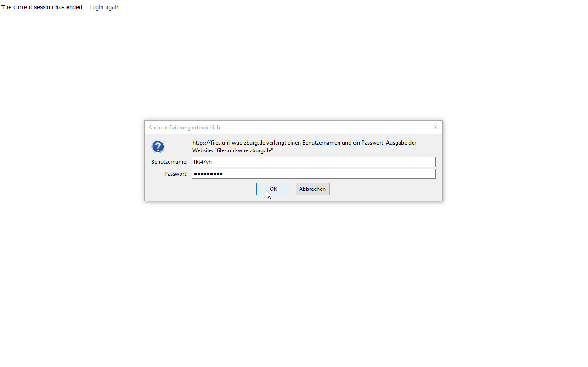
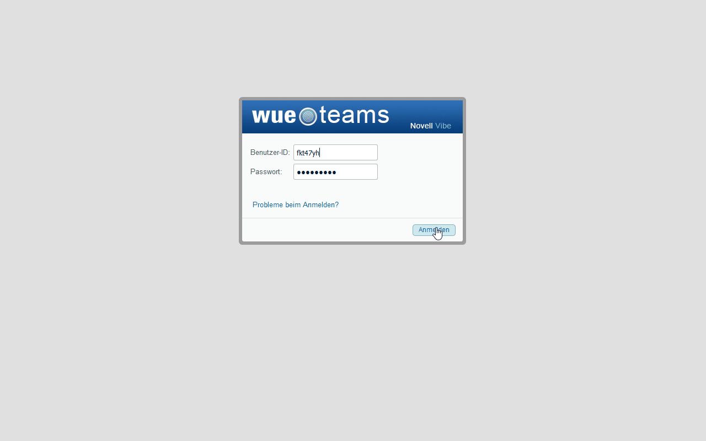

# Empra-Accounts #

Zugangsdaten per Mail erhalten.

Anmerkung: Die Bilder können mit einem Klick vergrößert im Browser
dargestellt werden.

## Open Science Framework ##

[OSF](https://osf.io): Zum **öffentlichen** Teilen der Auswertung, Daten,
Ergebnisse.

## Netzlaufwerk ##

[files.uni-wuerzburg.de](https://files.uni-wuerzburg.de): Zum Teilen
von internen Dateien.

+   Bitte den Ordner *ws19_empra* auf dem *J-Laufwerk* nutzen
+   Bei fehlendem Speicherplatz bitte Bescheid geben

über: [Files - webbasierter Zugriff auf Netzlaufwerke (RZ)](https://www.rz.uni-wuerzburg.de/dienste/arbeitsplaetze/netzlaufwerk/files/)

## Versuchspersonmanagement ##

[SONA](https://psywue.sona-systems.com): Zum Freischalten von Erhebungsterminen.

[Anleitung (Download)](https://www.psychologie.uni-wuerzburg.de/fileadmin/06020400/2019/FAQs_SONA_als_Forscher_innen.pdf)

## Laborplan ##

[WueTeams](https://wueteams.uni-wuerzburg.de): Zum Buchen der Laborräume.

über: [WueTeams: Zusammenarbeit im Team mit "Novell Vibe" (RZ)](https://www.rz.uni-wuerzburg.de/dienste/zusammenarbeit/wueteams/)

## E-Mail ##

[Webmail](https://webmail.uni-wuerzburg.de/login.php): Zum Kontakt mit
Versuchspersonen.
+   E-Mailadresse: [empra.grossekathoefer@uni-wuerzbug.de](mailto:empra.grossekathoefer@uni-wuerzbug.de)
