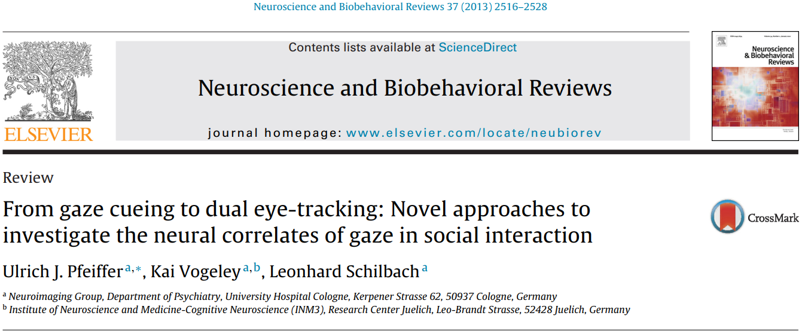

```{r setup, include=FALSE}

options(htmltools.dir.version = FALSE)

### Sitzungen
source("../scripts/dates.R", encoding = "UTF-8")
source("../scripts/random_color.R", encoding = "UTF-8")
farbe_der_woche = random_color()

```

## Wissenschaft

.footnote[aus Jaccard & Jacoby, 2009]

--

+   Ansatz zum Verstehen der Welt
    +   Theologie (*theology*)
    +   Rechtswissenschaft (*law*)
    +   Philosophie (*philosophy*)
    +   Geisteswissenschaften (*arts*)
    +   Naturwissenschaften (*science*)

`r icon::fa_arrow_right()` *befriedigende* Ansätze zur Abstraktion und
Bewältigung der Welt

--

.pull-left[

### universelle Grundlagen

+   Konzepte und Abhängigkeiten zwischen Konzepten
+   Limitation, was sie in der Welt addressieren
+   Präskriptive und evaluative Funktion

]

--

.pull-right[

### Bewertung von Aussagen

+   Konsensvalidierung
+   Expertenvalidierung
+   interne Validierung
+   systematische (empirische) Validierung

]


???

Teils Jahrtausende alte Perspektiven

---

## empirische Validierung: Experimente

.pull-left[

<p><a href="https://commons.wikimedia.org/wiki/File:Empirical_Cycle.svg#/media/File:Empirical_Cycle.svg"></a>
]

--

.pull-right[

0.  Problemstellung und Hypothesenbildung
0.  Versuchsplanung
0.  Versuchsaufbau
0.  Versuchsdurchführung
0.  Datenanalyse
0.  Dateninterpretation, Schlussfolgerung und Kommunikation

]

.footnote[

aus: Reiß & Sarris, 2012

]

--

## `r icon::fa_arrow_right(color = farbe_der_woche)` Einblicke in meine Arbeit


???

induktiv: Vom Speziellen (Beobachtungen) auf das Allgemeine --> Problem der
Induktiven Logik! Sokrates ist sterblich & Sokrates ist ein Mensch -> Alle
Menschen sind sterblich. Bodo ist ein Dackel & Bodo ist ein Hund -> Alle Hunde
sind Dackel.

deduktiv: Vom Allgemeinen (Einzelannahmen) auf das Spezielle --> valides
Begründen! Alle Menschen sind sterblich & Sokrates ist ein Mensch -> Sokrates
ist sterblich.

was ist wissenschaft
gute wissenschaftliche praxis
versuchsplanung bis durchführung
ergebnisse auswerten, interpretieren und analysieren

---
class: middle, center, inverse

# Forschungsideen

---

## Mobile eye tracking

.pull-left[

### SMI


]

--

.pull-right[

### Pupil Labs


]

---

## Theorie



---

## Theorie


---

class: inverse

## Für nächste Woche:

+ Vorbereiten:
    + Pfeiffer, U. J., Vogeley, K., & Schilbach, L. (2013). From gaze cueing to
      dual eye-tracking: novel approaches to investigate the neural correlates
      of gaze in social interaction. Neuroscience & Biobehavioral Reviews,
      37(10), 2516-2528. [[doi:
      10.1016/j.neubiorev.2013.07.017](https://doi.org/10.1016/j.neubiorev.2013.07.017)]
    + Jarick, M., & Kingstone, A. (2015). The duality of gaze: eyes extract and
      signal social information during sustained cooperative and competitive
      dyadic gaze. Frontiers in psychology, 6, 1423. [[doi:
      10.3389/fpsyg.2015.01423](https://doi.org/10.3389/fpsyg.2015.01423)]

---

class: inverse, center, middle

# Noch Fragen?

---

class: inverse, center, middle

`r icon::fa_smile(size = 5, color = farbe_der_woche)`

Die Farbe der Woche ist `r farbe_der_woche`!

--

# Vielen Dank für Eure Aufmerksamkeit!


## Bis nächsten Montag.

--

.footnote[

<font size="-2">Slides created via the R packages
[**xaringan**](https://github.com/yihui/xaringan) and
[knitr](http://yihui.name/knitr), and [R
Markdown](https://rmarkdown.rstudio.com).

<a rel="license" href="http://creativecommons.org/licenses/by-sa/4.0/"></a><br />Dieses
Werk ist lizenziert unter einer <a rel="license"
href="http://creativecommons.org/licenses/by-sa/4.0/">Creative Commons
Namensnennung - Weitergabe unter gleichen Bedingungen 4.0 International
Lizenz</a>.</font size>

            ]


---

# Quellen

