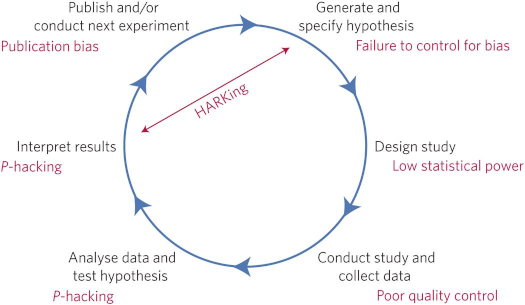

```{r setup, include=FALSE}

options(htmltools.dir.version = FALSE)

### Sitzungen
source("../scripts/dates.R", encoding = "UTF-8")
source("../scripts/random_color.R", encoding = "UTF-8")
farbe_der_woche = random_color()

```
class: inverse, center, middle

# Theorie #

.center[

`r icon::fa_bullhorn(size=5, color = farbe_der_woche)`

]

---

## Sitzungen ##

`r sitzung_html`

---
class: inverse, center, middle

# Eigenes Projekt #

.center[

`r icon::fa_vial(size=5, color = farbe_der_woche)`

`r icon::fa_burn(size=5, color = "orange")`

]

---
class: inverse, center, middle

# Good Scientific Practice #

---

## Reproducible Science ##

.center[



]

--

+  Präregistrieren von (u.a.) Hypothesen gilt als "Good Scientific Practice"
   ([Munfanò et al., 2017](https://www.nature.com/articles/s41562-016-0021))

.pull-left[

[](https://aspredicted.org)

]

.pull-right[

[](https://cos.io/prereg/)

]

---

### Hypothesen ###

--

#### Gütemerkmale ####

+   Falsifizierbarkeit
+   Präzisierbarkeit
+   Theorierelevanz
+   Parsimonität ([Occam's Razor](https://de.wikipedia.org/wiki/Ockhams_Rasiermesser))
--

    > In no case is an animal activity to be interpreted in terms of higher
    > psychological processes, if it can be fairly interpreted in terms of
    > processes which stand lower in the scale of psychological evolution and
    > development. (Morgan, 1906)


.footnote[

aus: Reiß, S. & Sarris, V. (2012). Experimentelle Psychologie: Von Theorie zur
Praxis. Pearson Studium.

]

???

präzisierbarkeit durch weiteren Faktor


---
class: inverse

## Für nächste Woche:

+   Forschungsdesign, -ideen, -hypothesen?
+   Präregistrierung anschauen
    +    Welche Fragen müssen beantwortet werden?
    +    Welche Fragen können bereits beantwortet werden?

---

class: inverse, center, middle

# Noch Fragen?

---

class: inverse, center, middle

`r icon::fa_smile(size = 5, color = farbe_der_woche)`

Die Farbe der Woche ist `r farbe_der_woche`!

--

# Vielen Dank für Eure Aufmerksamkeit!


## Bis nächsten Montag.

--

.footnote[

<font size="-2">Slides created via the R packages
[**xaringan**](https://github.com/yihui/xaringan) and
[knitr](http://yihui.name/knitr), and [R
Markdown](https://rmarkdown.rstudio.com).

<a rel="license" href="http://creativecommons.org/licenses/by-sa/4.0/"></a><br />Dieses
Werk ist lizenziert unter einer <a rel="license"
href="http://creativecommons.org/licenses/by-sa/4.0/">Creative Commons
Namensnennung - Weitergabe unter gleichen Bedingungen 4.0 International
Lizenz</a>.</font size>

            ]


---

# Quellen

